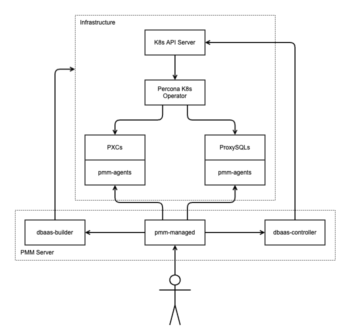

# Welcome to DBaaS Controller

We're glad that you would like to become a Percona community member and participate in keeping open source open. [DBaaS Controller](https://docs.percona.com/percona-monitoring-and-management/setting-up/server/dbaas.html) exposes simplified API to manage database clusters powered by [Percona Kubernetes Operators](https://www.percona.com/software/percona-kubernetes-operator).

## DBaaS Architecture

DBaaS is a part of [PMM Managed](https://github.com/percona/pmm) and runs on the PMM Server side. DBaaS controller is responsible for controlling Percona Kubernetes Operators via Kubernetes API and its objects. It provides a simplified API for that for pmm-managed to use. It doesn't have its own persisted state.

> **Note**
> dbaas-builder component is planned and does not exist at the moment



### Kubernetes client

Kubernetes API mainly consists of creation, modification, and deletion of various Kubernetes objects: pods, stateful sets, etc. Percona Kubernetes Operators are mainly controlled via custom resources (CRs) - higher-level objects. For example, operators (and Kubernetes) do not provide API to "scale this cluster from 3 to 5 instances"; instead, one should get an existing CR, edit it by changing 3 to 5, and sending an updated resource back. Of course, there is a problem with concurrent updates of the same resource that can be solved with resource versioning. Alternatively, one can use a patch API to update existing CR in-place, but it is harder to implement. dbaas-controller's Kubernetes client will use the first (receive-modify-send) approach until it is clear where we need patches (i.e., do we have a UI where we have to use patches). Additionally, we will not use resource versions / generations yet because we will forbid concurrent resource modifications on a different layer (see below).

Percona Kubernetes Operators CRs are documented there:

- https://www.percona.com/doc/kubernetes-operator-for-pxc/operator.html
- https://www.percona.com/doc/kubernetes-operator-for-psmongodb/operator.html
- https://www.percona.com/doc/kubernetes-operator-for-postgresql/operator.html

Most Kubernetes operations are asynchronous by nature: the user modifies some Kubernetes API object and then waits for the reconciliation loop to finish. What "finish" means is operation-dependant. In our case, most CR modifications are considered finished when CR's "status.state" field reaches the final value: "ready" or "error" for XtraDBCluster CR, "Succeeded" or "Failed" for XtraDBBackup CR, etc. – they are type-specific. But some operations require custom logic for checking is they are finished. For example, cluster deletion is considered finished when there are no objects matching "app.kubernetes.io/instance=<CLUSTER NAME>" label filter. Given that, in most cases, operation status is equal to CR status.state, and a number of special cases is small, dbaas-controller's Kubernetes client will not expose methods for waiting for an operation to complete or for subscribing to status updates. Instead, it will expose simple methods like getting a list of database clusters (including a list of clusters that are being deleted and do not have a CR already) or applying a change to a given CR. That may change in the future once we have a use-case for that.

dbaas-controller's Kubernetes client is a wrapper around kubectl CLI tool. On the one hand, it solves a lot of hard problems we don't want to start solving now by using API directly: one example is Kubernetes authentication and authorization, which is handled by providing kubeconfig file for each kubectl invocation. It also makes it much easier to debug interactions with the operator. On the other hand, we can't use dbaas-cli because we require much more control than this "simplest DBaaS tool in the world" can provide.

dbaas-controller's Kubernetes client is fully configured with kubeconfig file. It contains information about Kubernetes API server address, authentication and authorization mechanisms, default namespace, etc. The whole kubeconfig file content is passed to the client constructor.

#### Kubernetes client revised

When it made a lot of sense to start with kubectl CLI, number of months later (Apr 2022) it is not anymore as it means we probably need to update it quite often and maybe support number of those binaries in our code. Also it is against k8s tools skew version policies to maintain old binaries in our code.

Also client-go advanced, it now supports several authentication mechanisms and also a quite good compatibility matrix:

- kubeconfig support
- Authenticating inside the cluster
- GCP, AWS auth


From our requirements we need to support GKE, EKS and OpenShift platforms:

- EKS k8s versions
- GKE k8s versions
- OpenShift Life Cycle


Those platforms and k8s life cycle are actually the same (OpenShift 4.6 EUS on 1.19 which in sync with k8s releases), so it makes perfect sense to use native library that have the same life cycle.

Native library also support previous version of k8s that we can test and also declare as supported if we want to.

### APIs
dbaas-controller exposes gRPC APIs for pmm-managed to use. There is no JSON APIs and no interaction between Grafana/UI/anything else and dbaas-controller. Those APIs allow starting various operations asynchronously. pmm-managed then uses List/Get API calls to poll for state changes.

An approximate list of methods it will implement (XtraDB and MongoDB operators, clusters, backups, and restores use different methods; the distinction is omitted for brevity):

- Install or upgrade operator
- Uninstall operator
- List clusters
- Create a cluster with given parameters
- Update cluster with given parameters
- Delete cluster
- List backups
- Create backup
- Delete backup
- Restore from backup

Update clusters API accepts and updates all parameters known to dbaas-controller and pmm-managed due to proto3 and Go zero value conventions. Сonsequently, those components releases should be in sync. That's not a problem for PMM, but in the future, we might consider a different API method that updates only set fields.

All API methods accept kubeconfig file content, as discussed above. dbaas-controller does not keep track of Kubernetes clusters – that's pmm-managed's job (and, in the future, dbaas-builder's).

dbaas-controller returns FailedPrecondition error for API calls that modify CR that is not in a finished state, preventing concurrent updates. As discussed above, we can lift that restriction later once we need it.

API is being drafted at https://github.com/percona-platform/dbaas-api

### PMM APIs

[pmm-managed](https://github.com/percona/pmm) is the only component that interacts with dbaas-controller.

pmm-managed is responsible for storing information about existing Kubernetes cluster and their kubeconfig file content. It also provides APIs for that. In the future, it will also drive Kubernetes clusters management with dbaas-builder.

pmm-managed also exposes APIs for managing database clusters. Most of them are thin wrappers around dbaas-controller APIs. However, pmm-managed contains some logic:

- It contains recommended database cluster templates.
- It prevents registration of the same Kubernetes cluster+namespace combination.

API has been first drafted at https://github.com/percona/pmm/pull/549


## Running locally

Firstly, follow [contributing guidelines for PMM](https://github.com/percona/pmm/blob/main/CONTRIBUTING.md#pmm-server-1) to set up PMM locally.

### Prerequisites

1. Go installed
2. minikube
3. Docker

### Running minikube

To spin-up k8s cluster, run
```
    minikube start --cpus=4 --memory=7G --apiserver-names host.docker.internal --kubernetes-version=v1.23.0
    cd /path/to/pmm/repo
    ENABLE_DBAAS=1 NETWORK=minikube make env-up # Run PMM with DBaaS feature enabled
```
[Read the documentation](https://docs.percona.com/percona-monitoring-and-management/setting-up/server/dbaas.html) how to run DBaaS on GKE or EKS

### Troubleshooting

1. You can face with pod failing with `Init:CrashLoopBackOff` issue. Once you get logs by running `kubectl logs pxc-cluster-pxc-0 -c pxc-init` you get the error `install: cannot create regular file '/var/lib/mysql/pxc-entrypoint.sh': Permission denied`. You can fix it using [this solution](https://github.com/kubernetes/minikube/issues/12360#issuecomment-1123794143). Also, check [this issue](https://jira.percona.com/browse/K8SPXC-879)
2. Multinode PXC Cluster can't be created on ARM CPUs. You can have single node installation.
3. Operators are not supported. It means that the PMM version <-> operator version pair does not exist in the Version service. This issue can happen in two different scenarios. You can have a PMM version higher than the current release, or you installed a higher version of operators. You can check compatibility using https://check.percona.com/versions/v1/pmm-server/PMM-version

## Submitting a Pull Request

See [Working with Git and GitHub](docs/process/GIT_AND_GITHUB.md) and [Common tech libraries and approaches](docs/process/common_tech_lib_approaches.md)

As a PR created you are responsible to:
* make sure PR is ready (linted, tested and etc)
* make sure it is reviewed (ask for review, ping reviewers and etc)
* make sure it is merged
  * merge when it is reviewed and tested
  * ask code owners/admins to merge it if merging is blocked for some reason

## Feature Build

PMM is quite complex project, it consists from many different repos descibed above. Feature Build (FB) is a way to get changes all together, build them all together, run tests and get client and server containers.

Please see: [How to create a feature build](https://github.com/Percona-Lab/pmm-submodules/blob/PMM-2.0/README.md#how-to-create-a-feature-build)

### The Goals of the Feature Builds

1. Provide an easy way to test/accept functionality for PO/PM and QA
2. Inform the Developer about Automation Tests results before the code is merged
3. (Future) Let the Developers add/modify e2e tests when they change functionality

### The Rules

1. Start Feature Build for every feature/improvement you are working on.
2. Start PullRequest to percona-lab/pmm-submodules as DRAFT.
3. Change the status of Pull Request from Draft to Open ONLY if your changes must be merged to pmm-submodules.
4. Include a short explanation in the Long Description field of the Feature in PR for feature build and checkboxes to all related Pull Requests. Check other [PRs](https://github.com/Percona-Lab/pmm-submodules/pulls) as examples.
5. After all related PRs in feature build are merged you should:
   a. either close the PR and delete the branch (this is the default option) or
   b. merge the PR to pmm-submodules repository (please note, this rarely needs to be merged, for example infrastructure changes do)

## Code Reviews

There are number of approaches for the code review and ownership: Code Ownership (CODEOWNERS), [github auto review](https://docs.github.com/en/github/setting-up-and-managing-organizations-and-teams/managing-code-review-assignment-for-your-team), PR owner assign ppl that are better fit for the particular code/job.

For more efficient review process we use a mixed approach:
* repos that have CODEOWNERS
  * add **auto-review-team** additionally to CODEOWNERS assigned
* repos that don't have CODEOWNERS
  * add **auto-review-team**
* if you know exactly who should review your code
  * add ppl to the review


| Team                 | Description                                                             | Members |
| -------------------- | ----------------------------------------------------------------------- | ------- |
| pmm-review-fe        | ppl for UI/UX reviews for [FrontEnd repos](#FrontEnd)                   | [FE team](https://github.com/orgs/percona/teams/pmm-review-fe/members)        |
| pmm-review-exporters | reviewers for all exporters [see PMM Client](#PMM-Client)               | [Exporters team](https://github.com/orgs/percona/teams/pmm-review-exporters/members) |
| pmm-review-be        | Back-End engineers                                                      | [BE team](https://github.com/orgs/percona/teams/pmm-review-be/members)        |
| PMM Admins           | ppl that could use admins rights to force merge or change repo settings | [PMM Admin team](https://github.com/orgs/percona/teams/pmm-admins/members)           |


## After your Pull Request is merged

Once your pull request is merged, you are an official Percona Community Contributor. Welcome to the community!

We're looking forward to your contributions and hope to hear from you soon on our [Forums](https://forums.percona.com) and [Discord](https://discord.gg/mQEyGPkNbR).
